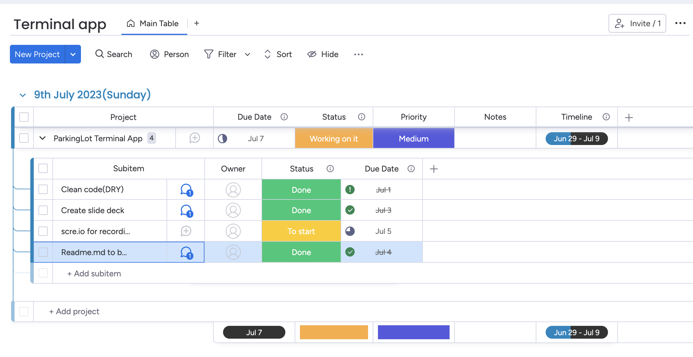

## Referenced sources
- (Source code & projects)[https://code-projects.org/parking-lot-system-in-python-with-source-code/]

## Link to source control repository
- (Github)[https://github.com/risabhmishra/parking_management_system/tree/master]

## Presentation link
- (Youtube) [https://youtu.be/yKUIIf_Pmgc]

# List of features
## 4 features
1. Take user vehicle types & registration.
2. Allocate parking space based on the number of parking spaces available.
3. Calculate parking fee based on vehicle entry & exit time.
4. Generate a report on user exit.

## Desciption of each features
1. Take 3 different vehicles types & registration number, allocate a parking space based on the vehicle & registration number.
2. User input amount of parking spaces available, app will allocate empty space to vehicles.
3. Time is being imported so we can find the default time to calculate the difference in entry & exit time. We then provide an hourly rate for the fee to be calculated.
4. When user initiate exit of the app, report will be generated on what type of vehicles & registration number, entry & exit time, as well as fee calculated.

# Implementation plan
## How each feature will be implemented and a checklist of tasks for each feature

## Feature 1 (Vehicle type & registration)
- ### Implementation
    1. User interface capture vehicle type & rego number.
    2. Form & input fields.
    3. Check input that it meet the requirement.

- ### Checklist of tasks
    1. User interface designation for veh info input.
    2. Input validation for rego #.

## Feature 2 (Parking spaces)
- ### Implementation
    1. Determine number of empty parking spaces.
    2. Collect veh. details from the code.
    3. Assign parking space to type of vehicle based on parking spaces.

- ### Checklist of tasks
    1. Function that track the parking spaces.
    2. Retrieve vehicle details from user inputs.
    3. Allocate parking spaces depending on availability of lots.
    4. Update parking lot spaces with the registration number and type of vehicle.

## Feature 3 (Fee calculations)
- ### Implementation
    1. Capture entry & exit time by importing package.
    2. Calculate time difference between entry & exit.
    3. Apply hourly rate to check the fee.
    4. Display correct fee to user.

- ### Checklist of tasks
    1. Design interface for user.
    2. Implement calculation to calculate the time difference.
    3. Display fee calculation to user.

## Feature 4 (Generating report)
- ### Implementation
    1. Retrieve vehicles details with entry & exit time.
    2. Generate report containing vehicle type, rego number, entry & exit time as well as calc fee.

- ### Checklist of tasks
    1. Fetch entry & exit time for vehicle.
    2. Generate correct information on the report.
    
# Prioritising implementation of features, or checklist items within a feature
## Feature 1 (Vehicle type & registration)
 - ### High priority
    - User interface for rego number.

 - ### Medium/Low priority
    - Input validation for rego number.
    - Database/datatructure to store veh details.
    - Functionality to save info.

## Feature 2 (Parking spaces)
 - ### High priority
    - Tracking availability of parking spaces
    - Logic to assign parking spaces baed on empty parking spaces.

 - ### Medium/Low priority
    - Retrieving vehicles details
    - Updating database/report to reflect parking spots.

## Feature 3 (Fee calculations)
 - ### High priority
    - Ability to capture entry & exit time.

 - ### Medium/Low priority
    - Setting up hourly rate & generate fee based on the time difference.
    - Display the correct fee to the user.

## Feature 4 (Generating report)
 - ### High priority
    - Retrieve veh details & entry/exit time for vehicle.

 - ### Medium/Low priority
    - Implement the correct fee based on the time difference.
    - Generate report based on the information that I requested for.

# Deadline, duration or other time indicator for each feature or checklist/checklist-item
- ### Feature 1 (Vehicle type & registration)
    - A day to include vehicle information, entry/exit time.
- ### Feature 2 (Parking spaces)
    - 2 - 3 days to track the parkinglot availability, implement code to assign parking spaces according to availability, collecting vehicle informations 

- ### Feature 3 (Fee calculations)
    - 1 - 2 days to design on capturing the correct time on entering & exiting. Function to calculate the parking fee based on the hourly rate set & displaying thee fee on exit.

- ### Feature 4 (Generating report)
    - 2 - 3 days to have function to generate a report with the right vehicle info, time as well as parking fees. Retrieving vehicle details from the code.

# Project management platform
 - [monday.com](https://jit74683.monday.com/boards/1804902174)

 

# Help documentation
1. ### Steps to install the application
    - Download ParkingLot terminal app from a source( e.g., Github repository).
    - Run installer file & follow the instructions.
    - Once installation completed correctly, application will then ready to use.

2. ### Dependencies required by the application to operate
    - Depending on OS system ( MacOS, Windows, Linux)

3. ### Any system/hardware requirements
    - Operating system that meets the minimum supported version
    - Processor
    - RAM (Min recommended RAM : 8GB)
    - Disk space ( Min disk space 200MB)
    - Display is up to user.
    
4. ### How to use any command line arguments made for the application
    - Launching application by double-clicking the icon or excute the command in the terminal.
    - Follow on screen instructions to navigate.
    - Enter vehicle type and vehicle registration number when prompted.
    - Entry & exit time will be recorded on entering & exiting.
    - Application will allocate parking space based on avilability, calculate fee and generate report on exit.
    - Refer to report or application interface for more informations.
 